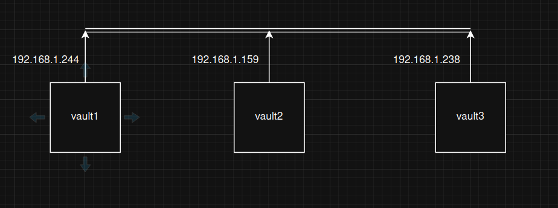
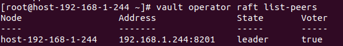
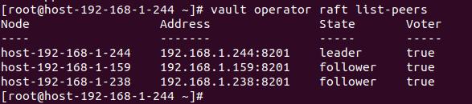

# Triển khai cụm Vault 
- Do cụm Vault dựa trên cơ chế đồng thuận Raft tích hợp sẵn nên cần số lượng node lẻ để tránh tình trạng split-brain và đảm bảo bầu leader
- Hệ điều hành: Linux (Ubuntu, CentOS, RHEL...)
- Cấu hình phần cứng: Tối thiểu 2 vCPU và 4GB RAM cho mỗi node (tùy thuộc vào lượng request và số lượng secret).


## Triển khai cụm trên CentOS-9
Sơ đồ triển khai



Bước 1: Trên tất cả các node tải và cài đặt Vault
```sh
yum install yum-utils
yum-config-manager --add-repo https://rpm.releases.hashicorp.com/RHEL/hashicorp.repo
yum -y install vault
```
Bước 2: Trên tất cả các node thêm cấu hình file /etc/hosts:
```sh
   192.168.1.244 host-192-168-1-244
   192.168.1.238 host-192-168-1-238
   192.168.1.159 host-192-168-1-159
```
Bước 3: Trên cả 3 node vào file `/etc/vault.d/vault.hcl` cấu hình
- Trên vault1:
```sh
ui = true
storage "raft" {
  path = "/opt/vault/data"
  node_id = "host-192-168-1-244"
  retry_join {
    leader_api_addr = "http://192.168.1.244:8200"
  }
  retry_join {
    leader_api_addr = "http://192.168.1.159:8200"
  }
  retry_join {
    leader_api_addr = "http://192.168.1.238:8200"
  }
}
cluster_addr = "http://192.168.1.244:8201"
listener "tcp" {
  address       = "192.168.1.244:8200"
  tls_disable = 1
}
api_addr = "http://192.168.1.244:8200"
disable_mlock = true
```
- Trên vault2
```sh
ui = true
storage "raft" {
  path = "/opt/vault/data"
  node_id = "host-192-168-1-159"
  retry_join {
    leader_api_addr = "http://192.168.1.244:8200"
  }
  retry_join {
    leader_api_addr = "http://192.168.1.238:8200"
  }
  retry_join {
    leader_api_addr = "http://192.168.1.159:8200"
  }
}
listener "tcp" {
  address       = "0.0.0.0:8200"
  tls_disable = 1
}
api_addr = "http://192.168.1.159:8200"
disable_mlock = true
cluster_addr = "http://192.168.1.159:8201"
```
- Trên vault3
```sh
ui = true
storage "raft" {
  path = "/opt/vault/data"
  node_id = "host-192-168-1-238"
  retry_join {
    leader_api_addr = "http://192.168.1.244:8200"
  }
  retry_join {
    leader_api_addr = "http://192.168.1.159:8200"
  }
  retry_join {
    leader_api_addr = "http://192.168.1.238:8200"
  }
}
listener "tcp" {
  address       = "0.0.0.0:8200"
  tls_disable = 1
}
api_addr = "http://192.168.1.238:8200"
disable_mlock = true
cluster_addr = "http://192.168.1.238:8201"
```
Bước 4: Trên cả 3 node tạo file audit log và restart lại dịch vụ vault
```sh
# Tạo file nếu chưa có
touch /var/log/vault_audit.log

# Cấp quyền sở hữu cho user vault (hoặc user bạn dùng để chạy Vault)
chown vault:vault /var/log/vault_audit.log

# Cấp quyền ghi
chmod 640 /var/log/vault_audit.log
systemctl restart vault
```
Bước 5: Trên tất cả các node gán export cho `VAULT_ADDR` và dùng lệnh init để lấy Unseal Key và Root Token
- Ví dụ trên vault1
```sh
export VAULT_ADDR="http://192.168.1.238:8200"
vault status 
vault operator init 
```
***LƯU Ý: LƯU KĨ LẠI CÁC KEY NÀY ĐỂ CẤU HÌNH VỀ SAU***

Bước 7: Chỉ trên node muốn làm Leader, Unseal trên node đó 
(VD trên node 1)
```sh
vault operator unseal
```
***LÀM LIÊN TIẾP 3 LẦN ĐẾN KHI NHẬN ĐƯỢC GIÁ TRỊ `Sealed` bằng false***
- Kiểm tra:
```sh
vault login <root-token ở trên>
vault operator raft list-peers
```


Bước 9: Unseal trên các node còn lại để trở thành follower cho leader
***LƯU Ý MÃ UNSEAL KEY Ở ĐÂY KHÔNG PHẢI LÀ CỦA CÁC NODE FOLLOWER MÀ PHẢI NHẬP MÃ UNSEAL KEY CỦA NODE LEADER***
```sh
vault operator unseal 
```
Bước 10: Kiểm tra trên node leader
```sh
vault operator raft list-peers
```


Bước 11: Tạo VIP bằng keepalived cho cụm để Ceph trỏ vào 
- Cài đặt keepalived 
```sh
yum install keepalived -y
```
- Cấu hình `check_vault.sh` check vault sống hay chết: 
```sh
cat <<'EOF' > /etc/keepalived/check_vault.sh
#!/bin/bash

CODE=$(curl -s --connect-timeout 2 -o /dev/null -w "%{http_code}" \
  http://127.0.0.1:8200/v1/sys/health)

# Chỉ leader/active mới được giữ VIP
if [[ "$CODE" == "200" ]]; then
  exit 0
else
  exit 1s
fi
EOF

chmod +x /etc/keepalived/check_vault.sh
setenforce 0
```
- Cấu hình file `/etc/keepalived/keepalived.conf`
```sh
vrrp_script check_vault {
    script "/etc/keepalived/check_vault.sh"
    interval 2
    weight 20
}

vrrp_instance VI_1 {
    state MASTER
    interface ens3         
    virtual_router_id 51
    priority 100             
    advert_int 1
    authentication {
        auth_type PASS
        auth_pass 12345      
    }
    virtual_ipaddress {
        192.168.1.100      
    }
    track_script {
        check_vault
    }
}
```
***LÀM TƯƠNG TỰ TRÊN CÁC NODE CÒN LẠI***

- Bước 11: Cấu hình trên Ceph trỏ ip của Vault về VIP