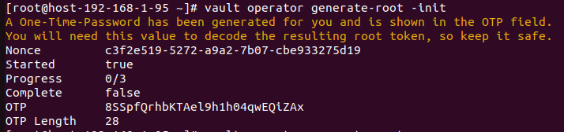
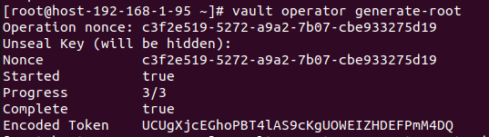
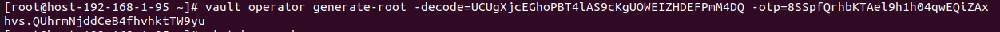

Bước 1: Tạo lại root token mới 
```sh
vault operator generate-root -init
```
- Sau câu lệnh trên sẽ trả về 1 mã otp. Lưu lại



Bước 2: Lấy mã encode của root token
```sh
vault operator generate-root
```
- Nhập 3 lần mã Unseal đã lưu và nó sẽ trả về 1 mã encode



Bước 3: Lấy lại root token
```sh
vault operator generate-root -decode=<encoded_token> -otp=<otp>
```


