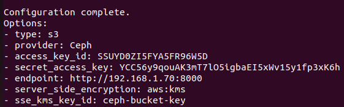
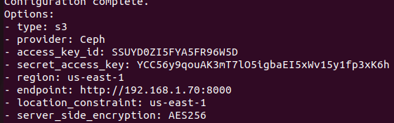
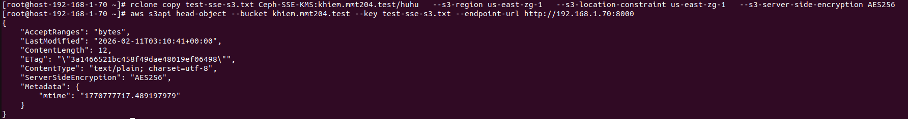
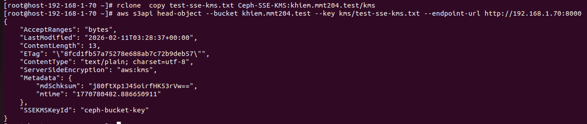
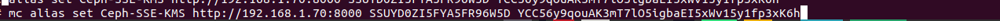
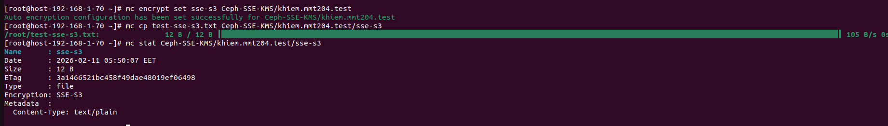
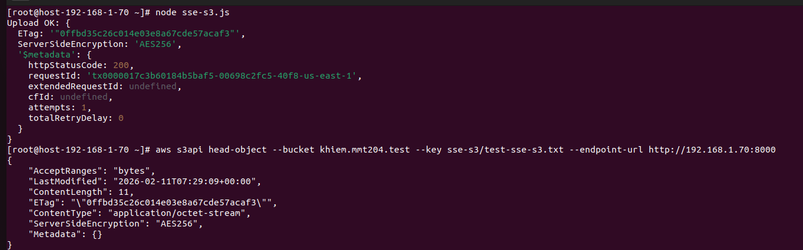
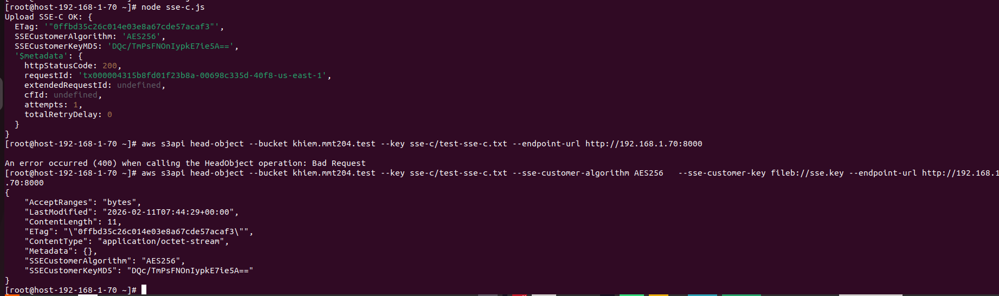

# Rclone
## 1. Tổng quan 
- Rclone là một công cụ dòng lệnh mã nguồn mở, dùng để quản lý, đồng bộ hóa, sao lưu hoặc di chuyển dữ liệu giữa máy tính, máy chủ và hơn 70 dịch vụ lưu trữ đám mây phổ biến
- Rclone chỉ hỗ trợ mã hóa cho SSE-S3 và SSE-KMS, không hỗ trợ SSE-C

## 2. Cài đặt và cấu hình 
### Cài đặt rclone
```sh
sudo -v ; curl https://rclone.org/install.sh | sudo bash
```
### Cấu hình rclone
```sh
rclone config 
type = s3
provider = Ceph
env_auth = false
access_key_id = XXX
secret_access_key = YYY
region =
endpoint = https://ceph.endpoint.example.com
location_constraint =
acl =
server_side_encryption =
storage_class =
```
***Cấu hình cho SSE-KMS***



***Cấu hình cho SSE-S3***



### Upload 
```sh
# SSE-S3
rclone copy test.txt Ceph-SSE-S3:khiem.mmt204.test/   --s3-region us-east-zg-1   --s3-location-constraint us-east-zg-1   --s3-server-side-encryption AES256   -P
```


```sh
# SSE-KMS
rclone  copy test-sse-kms.txt Ceph-SSE-KMS:khiem.mmt204.test/kms
```


# MinIO Client
## 1. Tổng quan
- MinIO Client là một trong những công cụ quản lý S3 phổ biến trên giao diện dòng lệnh. Hỗ trợ người dùng đã dạng thao tác thuận tiện hơn các bucket, object cũng như các tính năng khác trong S3.
- MinIO Client hỗ trợ mã hóa cho SSE-S3, SSE-KMS, SSE-C
## 2. Cài đặt và cấu hình
### Cài đặt MinIO Client 
```sh
curl -O https://dl.min.io/client/mc/release/linux-amd64/mc
chmod +x mc
mv mc /usr/local/bin/
```
### Cấu hình MinIO Client
- Cấu hình alias, endpoint, access-key và secret-key
```sh
mc alias set <ALIAS> <YOUR-S3-ENDPOINT> <YOUR-ACCESS-KEY> <YOUR-SECRET-KEY>
```

### Cấu hình upload bằng mã hóa SSE-KMS
```sh
mc encrypt set sse-kms ceph-bucket-key Ceph-SSE-KMS/khiem.mmt204.test
mc cp test2.txt Ceph-SSE-KMS/khiem.mmt204.test/hihi
mc stat Ceph-SSE-KMS/khiem.mmt204.test/hihi
```


### Cấu hình upload bằng mã hóa SSE-S3
```sh
mc encrypt set sse-s3 Ceph-SSE-KMS/khiem.mmt204.test
mc cp test-sse-s3.txt Ceph-SSE-KMS/khiem.mmt204.test/sse-s3
mc stat Ceph-SSE-KMS/khiem.mmt204.test/sse-s3
```


### Cấu hình upload bằng mã hóa SSE-C
***LƯU Ý: Chỉ dùng được SSE-C khi có chứng chỉ https***
- MinIO ko hỗ trợ set SSE-C mà phải cấu hình mặc định
- Tạo một khóa ngẫu nhiên dạng Base64
```sh
openssl rand -base64 32
```
- Gán khóa cho một Bucket cụ thể
```sh
export MC_ENCRYPT_KEY="myminio/my-bucket=7u5v...v8A="
```
- Upload file bình thường sẽ tự áp dụng SSE-C
### Xóa cấu hình 
```sh
mc encrypt clear myaistor/mydata
```
## Upload bằng Python 
- Cài đặt python3.11 trở lên và thư viện boto3
```sh
sudo dnf install python3.11
python3.11 -m venv venv
source venv/bin/active
pip install boto3
```

### SSE-S3
```sh
import boto3
s3_client = boto3.client(
    's3',
    endpoint_url='http://192.168.1.142:8000',
    aws_access_key_id='4Z0I11STI5YXIHC4PCX2',
    aws_secret_access_key='mLaKyEA6t9YzzqaMRwLpZXLnQ4IOyYMrOx4z21fa',
    region_name='us-east-1'
)
def upload_with_sse_s3(bucket, key, data):
    response = s3_client.put_object(
        Bucket=bucket,
        Key=key,
        Body=data,
        ServerSideEncryption= 'AES256'
    )
    return response
upload_with_sse_s3('khiem.mmt.test', 'test.txt', 'Nội dung bảo mật')
```
### SSE-KMS
```sh
import boto3
s3_client = boto3.client(
    's3',
    endpoint_url='http://10.2.1.54:8000',
    aws_access_key_id='EADBJIHZ3INBHZ9S73WA',
    aws_secret_access_key='45H2flJh9yy8bJSlhm02WAwWWXRpWivwCodritLv',
    region_name='us-east-1'
)
def upload_with_sse_s3(bucket, key, data):
    response = s3_client.put_object(
        Bucket=bucket,
        Key=key,
        Body=data,
        ServerSideEncryption= 'aws:kms',
        SSEKMSKeyId='ceph-bucket-key'
    )
    return response
upload_with_sse_s3('khiem.mmt2004.test', 'test1.txt', 'Nội dung bảo mật')
```
### SSE-C
```sh
import boto3
from botocore.config import Config

endpoint = "http://192.168.1.70:8000"
access_key = "SSUYD0ZI5FYA5FR96W5D"
secret_key = "YCC56y9qouAK3mT7lO5igbaEI5xWv15y1fp3xK6h"

bucket = "khiem.mmt204.test"
key = "test-sse-s3.txt"

# Đọc RAW key giống awscli fileb://sse.key
with open("sse.key", "rb") as f:
        raw_key = f.read()

print("Key length:", len(raw_key))  # phải = 32

s3 = boto3.client(
     "s3",
     endpoint_url=endpoint,
     aws_access_key_id=access_key,
     aws_secret_access_key=secret_key,
     config=Config(signature_version="s3v4"),
     use_ssl=False
     )

sse_args = {
    "SSECustomerAlgorithm": "AES256",
    "SSECustomerKey": raw_key
    }
s3.put_object(Bucket=bucket, Key=key, Body=b"data", **sse_args)
```
## Upload bằng NodeJS
- Cài đặt NodeJS và thư viện
```sh
curl -o- https://raw.githubusercontent.com/nvm-sh/nvm/v0.40.3/install.sh | bash
\. "$HOME/.nvm/nvm.sh"
nvm install 24
node -v # Should print "v24.13.1".
npm -v # Should print "11.8.0".
npm init -y
npm i @aws-sdk/client-s3
```
### SSE-S3
```sh
import { S3Client, PutObjectCommand } from "@aws-sdk/client-s3";
import fs from "fs";

const s3 = new S3Client({
          region: "us-east-1",
          endpoint: "http://192.168.1.70:8000",
          credentials: {
                      accessKeyId: "SSUYD0ZI5FYA5FR96W5D",
                      secretAccessKey: "YCC56y9qouAK3mT7lO5igbaEI5xWv15y1fp3xK6h",
                    },
          forcePathStyle: true, // QUAN TRỌNG khi dùng Ceph RGW
});
const bucket = "khiem.mmt204.test";
const key = "sse-s3/test-sse-s3.txt";

async function main() {
      const body = fs.readFileSync("./test.txt");
      const cmd = new PutObjectCommand({
        Bucket: bucket,
        Key: key,
        Body: body,
        ServerSideEncryption: "AES256",
 });
      const res = await s3.send(cmd);
      console.log("Upload OK:", res);
}

main().catch(console.error);
```



### SSE-KMS

```sh
import { S3Client, PutObjectCommand } from "@aws-sdk/client-s3";
import fs from "fs";

const s3 = new S3Client({
          region: "us-east-1",
          endpoint: "http://192.168.1.70:8000",
          credentials: {
                      accessKeyId: "SSUYD0ZI5FYA5FR96W5D",
                      secretAccessKey: "YCC56y9qouAK3mT7lO5igbaEI5xWv15y1fp3xK6h",
                    },
          forcePathStyle: true, // QUAN TRỌNG khi dùng Ceph RGW
});
const bucket = "khiem.mmt204.test";
const key = "sse-s3/test-sse-s3.txt";

async function main() {
      const body = fs.readFileSync("./test.txt");
      const cmd = new PutObjectCommand({
        Bucket: bucket,
        Key: key,
        Body: body,
        ServerSideEncryption: "aws:kms",
        SSEKMSKeyId: "ceph-bucket-key",

 });
      const res = await s3.send(cmd);
      console.log("Upload OK:", res);
}

main().catch(console.error);
```


### SSE-C
```sh
import { S3Client, PutObjectCommand } from "@aws-sdk/client-s3";
import fs from "fs";
import crypto from "crypto";

const s3 = new S3Client({
  region: "us-east-1",
  endpoint: "http://192.168.1.70:8000",
  credentials: {
    accessKeyId: "YOUR_ACCESS_KEY",
    secretAccessKey: "YOUR_SECRET_KEY",
  },
  forcePathStyle: true,
});

const bucket = "khiem.mmt204.test";
const key = "sse-c/test-sse-c.txt";

async function main() {
  const body = Buffer.from("hello sse-c ceph");
  const rawKey = fs.readFileSync("./sse.key");
  const b64Key = rawKey.toString("base64");
  const md5Key = crypto.createHash("md5").update(rawKey).digest("base64");

  const cmd = new PutObjectCommand({
    Bucket: bucket,
    Key: key,
    Body: body,
    SSECustomerAlgorithm: "AES256",
    SSECustomerKey: b64Key,
    SSECustomerKeyMD5: md5Key,
  });

  const res = await s3.send(cmd);
  console.log("Upload SSE-C OK:", res);
}

main().catch(console.error);
```


