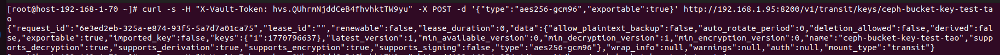
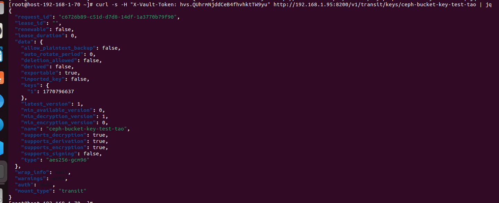
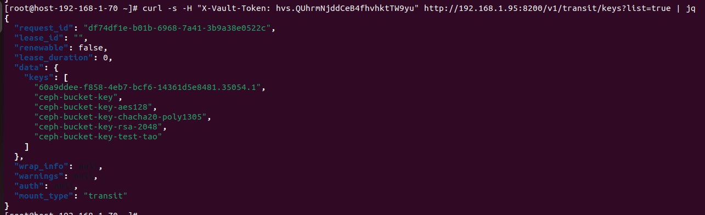
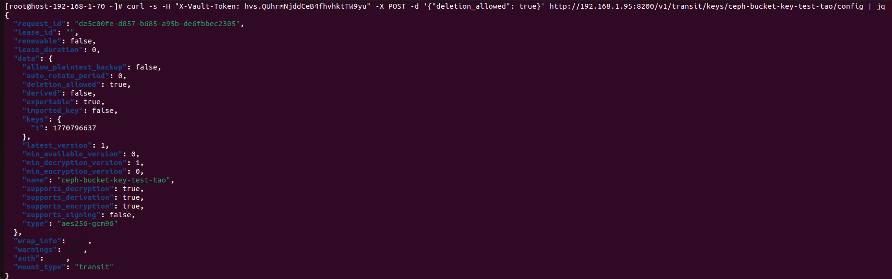
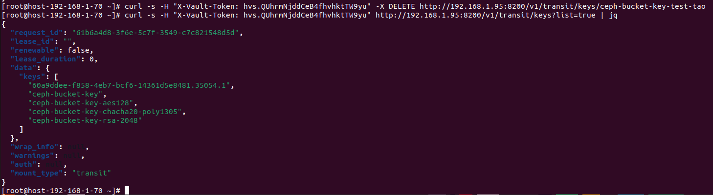

# Tạo, xem, xóa key của Vault bằng url

## 1. Tạo
```sh
curl -s -H "X-Vault-Token: ROOT_OR_ADMIN_TOKEN" -X POST -d '{"type":"aes256-gcm96","exportable":true}' http://127.0.0.1:8200/v1/transit/keys/ceph-bucket-key-test-tao
```


## 2. Xem key có tồn tại không
```sh
curl -s -H "X-Vault-Token: ROOT_OR_ADMIN_TOKEN" http://127.0.0.1:8200/v1/transit/keys/ceph-bucket-key-test-tao | jq
```


## 3. List tất cả key trong transit
```sh 
curl -s -H "X-Vault-Token: ROOT_OR_ADMIN_TOKEN" http://127.0.0.1:8200/v1/transit/keys?list=true | jq
```

## 4. Xóa key
- Gửi thông báo cho phép xóa key đó
```sh
curl -s -H "X-Vault-Token: ROOT_OR_ADMIN_TOKEN" -X POST -d '{"deletion_allowed": true}' http://127.0.0.1:8200/v1/transit/keys/ceph-bucket-key-test-tao/config | jq
```



- Xóa key
```sh
curl -s -H "X-Vault-Token: ROOT_OR_ADMIN_TOKEN" -X DELETE http://127.0.0.1:8200/v1/transit/keys/ceph-bucket-key-test-tao
```

