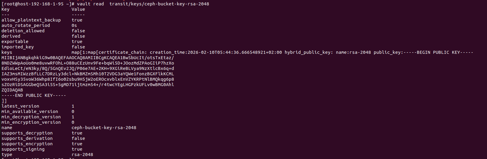
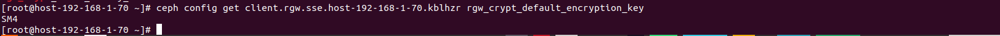
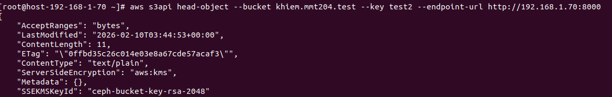

# CƠ CHẾ MÃ HÓA DỮ LIỆU (ENCRYPTION) TRONG CEPH RGW & HASHICORP VAULT
## 1. Tổng quan kiến trúc

Trong hệ thống lưu trữ đối tượng, việc mã hóa dữ liệu tại chỗ được thực hiện thông qua sự phối hợp giữa RadosGW và một hệ thống quản lý khóa tập trung.

Cơ chế cốt lõi được sử dụng là Envelope Encryption (Mã hóa phong bì).
Thành phần chính:

  - Data Encryption Key (DEK): Là khóa dùng để trực tiếp mã hóa nội dung file (Object). Khóa này được sinh ra ngẫu nhiên cho từng Object.

  - Key Encryption Key (KEK): Là "khóa chủ" (Master Key) nằm trong Vault. Khóa này dùng để mã hóa (khóa lại) chính cái DEK.
## 2. Các loại thuật toán và chuẩn mã hóa
2.1. Tại Data Layer (DEK - Trong Ceph RGW)

Đây là các thuật toán trực tiếp "xào nấu" dữ liệu trên đĩa. RGW hỗ trợ:

  - AES-256-GCM (Mặc định): Tiêu chuẩn vàng toàn cầu, hiệu năng cực cao nhờ hỗ trợ phần cứng (AES-NI).

  - SM4: Tiêu chuẩn mật mã của Trung Quốc (khóa 128-bit). Thường dùng trong các môi trường yêu cầu tuân thủ pháp lý đặc thù.

  - AES-128: Ít phổ biến hơn, dùng khi muốn tối ưu thêm một chút tốc độ.

2.2. Tại Key Management Layer (KEK - Trong Vault)

Vault Transit Engine cho phép khởi tạo nhiều loại Master Key:

  - AES-GCM (128, 256-bit): Khóa đối xứng, tốc độ nhanh nhất.

  - RSA (2048, 3072, 4096-bit): Khóa bất đối xứng. Mặc dù RSA có giới hạn dung lượng mã hóa (vài trăm bytes), nó vẫn hoạt động hoàn hảo trong SSE-KMS vì nó chỉ cần mã hóa cái DEK (vốn rất nhỏ).

  - ChaCha20-Poly1305: Lựa chọn thay thế cho AES trên các thiết bị không có hỗ trợ phần cứng.

  - AES-CBC (128, 256-bit): Khóa đối xứng, dùng ở chế độ Cipher Block Chaining, có hỗ trợ mã hóa hội tụ, chỉ dùng trong bản Enterprise của Vault

## 3. Quy trình vận hành SSE-KMS (Vault Backend)

  - Client: Gửi lệnh Upload (PUT Object) kèm tham số --sse aws:kms.

  - RGW: Sinh ra một khóa DEK ngẫu nhiên (ví dụ thuật toán SM4 hoặc AES-256).

  - RGW gọi Vault: Gửi DEK sang Vault, yêu cầu khóa lại bằng Master Key (ví dụ RSA-2048).

  - Vault: Trả về "bản mã" của DEK.

  - RGW: Mã hóa file bằng DEK thực tế, sau đó lưu file kèm theo DEK đã mã hóa vào metadata của Object trên Ceph OSD.

## 4. Hướng dẫn cấu hình thực tế
4.1. Khởi tạo Master Key trong Vault
```sh
# Tạo và đọc khóa Master loại RSA
vault write -f transit/keys/ceph-bucket-key-rsa-2048 type=rsa-2048
vault read  transit/keys/ceph-bucket-key-rsa-2048

# Hoặc tạo khóa Master loại AES (Khuyên dùng)
vault write -f transit/keys/ceph-bucket-key-aes256-gcm96 type=aes256-gcm96
vault read  transit/keys/ceph-bucket-key-aes256-gcm96
```



4.2. Cấu hình trên Ceph RGW 

- Để RGW nhận diện và sử dụng Vault:
```sh
# Cấu hình loại hình mã hóa dành cho RGW (AES256, AES128, SM4)
ceph config set client.rgw.sse.host-192-168-1-70.kblhzrrgw_crypt_default_encryption_key AES256 
# Cấu hình backend cho sse-kms là vault
ceph config set client.rgw.sse.host-192-168-1-70.kblhzr rgw_crypt_s3_kms_backend vault
# Cấu hình địa chỉ truy cập Vault cho sse-kms
ceph config set client.rgw.sse.host-192-168-1-70.kblhzr rgw_crypt_vault_addr http://192.168.1.142:8200
# Cấu hình auth để truy cập vault là token 
ceph config set client.rgw.sse.host-192-168-1-70.kblhzr rgw_crypt_vault_auth token
# Cấu hình nơi để export thông tin dữ liệu để mã hóa
ceph config set client.rgw.sse.host-192-168-1-70.kblhzr rgw_crypt_vault_prefix /v1/transit 
# Cấu hình nói lưu trữ là transit
ceph config set client.rgw.sse.host-192-168-1-70.kblhzr rgw_crypt_vault_secret_engine transit
# Cấu hình đường dẫn tới file token 
ceph config set client.rgw.sse.host-192-168-1-70.kblhzr rgw_crypt_vault_token_file /etc/ceph/vault.token 
# Cấu hình tắt truy cập bằng cert 
ceph config set client.rgw.sse.host-192-168-1-70.kblhzrrgw_crypt_require_ssl false
```
4.3. Lệnh kiểm tra và xác thực
- Kiểm tra xem RGW đang sử dụng loại mã hóa nào:
```sh 
ceph config get client.rgw.sse.host-192-168-1-70.kblhzr rgw_crypt_default_encryption_key
```


Kiểm tra metadata của một object để xem nó đang dùng khóa nào:
```sh
aws s3api head-object --bucket khiem.mmt204.test --key test2 --endpoint-url http://192.168.1.70:8000
```


