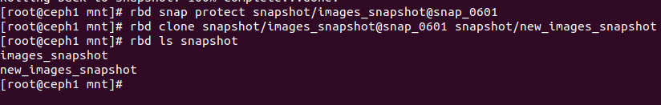

# Khái niệm
 1. Snapshot
    - Là một bản ghi trạng thái của một quá trình tại một thời điểm nhất định mà không thể thay đổi nó (read-only).
    - Cơ chế hoạt động: Snapshot không phải là copy dữ liệu ngay lập tức mà chỉ là đóng băng metadata tại thời điểm nó lại, chỉ khi có sự thay đổi dữ liệu kể từ khi snapshot thì hệ thống mới giữ lại các khối dữ liệu của snapshot cũ và ghi các khối dữ liệu mới ra chỗ khác
 2. Clone 
    - Clone là việc tạo ra một bản sao có thể ghi chép dựa trên 1 snapshot có sẵn.
    - Cơ chế hoạt động: Ta không thể tạo 1 bản sao từ một images có sẵn mà phải snapshot nó lại, protect nó rồi mới có thể clone đc chúng. Việc clone giống như ta phô tô 1 đề thi thành nhiều bản khác nhau và ta có thể làm gì các bản đó cũng được mà không làm thay đổi bản gốc
 3. Mirror
    - Là một quá trình đồng bộ hóa liên tục dữ liệu từ nơi này qua nơi khác 
    - Cơ chế hoạt động: Giả sử có 2 cụm Ceph. Khi ta ghi dữ liệu vào cụm 1, nó sẽ thêm 1 cuốn nhật ký Journal và bên cụm 2 sẽ có 1 tiến trình nền sẽ đọc được cuốn nhật kí này của cụm 1 và sẽ thao tác thực hiện y như bên cụm 1
# Thực Hành 
## Tạo, khôi phục dữ liệu và xóa Snapshot
Bước 1: Xác định được pool nào cần snapshot 
 - Liệt kê các pool:
```sh
ceph osd lspools
```
 - Liệt kê các images trong pool:
 ```sh
 rbd ls snapshot
 ```
Bước 2: Tạo snapshot cho pool đấy 
```sh
rbd snap create snapshot/images_snapshot@snap_0601
```
! [](images_RADOS/anh15.png)

Bước 3: Khôi phục dữ liệu snapshot
```sh
rbd snap rollback snapshot/images_snapshot@snap_0601
```
! [](images_RADOS/anh16.png)

Bước 4: Xóa snapshot
```sh
rbd snap rm snapshot/images_snapshot@snap_0601
```
## Tạo và xóa clone
Bước 1: Tạo snapshot đc như bên trên
Bước 2: Bật chế độ protect cho snapshot không thể bị xóa khi đang có bản Clone dựa vào
```sh
rbd snap protect snapshot/images_snapshot@snap_0601
```
Bước 3: Giờ có thể tạo được bản Clone images mới cho Snapshot đó
```sh
rbd clone snapshot/images_snapshot@snap_0601 snapshot/new_images_snapshot
```



hoặc có thể tạo bản clone độc lập hoàn toàn với bản gốc
```sh
rbd flatten snapshot/new_images_snapshot
```
Bước 3: Xóa clone
```sh
rbd snap rm snapshot/new_images_snapshot
```

