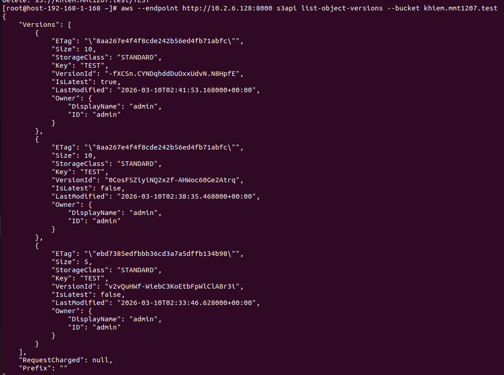
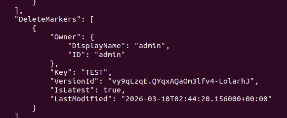
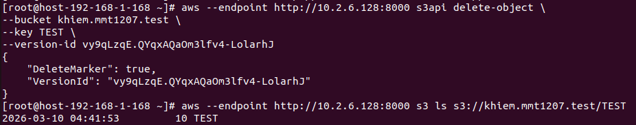
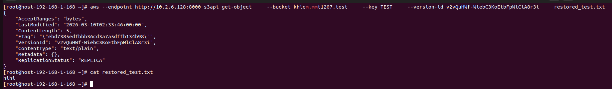

# Versioning
## Khái niệm
- Là cơ chế lưu nhiều phiên bản của cùng 1 object trong cùng một bucket
- Cho phép mỗi lần PUT hoặc Delete một object trong cùng 1 object sẽ tạo ra một hay nhiều phiên bản mới mà không xóa đi phiên bản cũ
## Triển khai  
1. Bật chế độ Versioning cho bucket

```sh
aws --endpoint <địa chỉ> s3api put-bucket-versioning --bucket <tên bucket> --versioning-configuration Status=Enabled
```

2. Tải 1 file với 2 nội dung khác nhau lên 

```sh
aws --endpoint <địa_chỉ> s3 cp test.txt <tên_bucket>
echo "hihi" >> test.txt
aws --endpoint <địa_chỉ> s3 cp test.txt <tên_bucket>
```
3. Liệt kê các phiên bản 

```sh
aws --endpoint <địa chỉ> s3api list-object-versions --bucket <tên_bucket>
```


Giải thích: 
  - IsLatest: True là bản mới nhất còn False là bản cũ
  - VersionId: ID của version đó
  - LastModified: Thời gian upload
4. Xóa và khôi phục bucket
  - Xóa và xem hiển thị trường `DeleteMarkets`
```sh 
aws --endpoint <địa_chỉ> s3 rm  <tên_bucket>
aws --endpoint <địa_chỉ> s3api list-object-versions --bucket <tên_bucket>
```

  
  - Xóa DeleteMarker khôi phục bucket
```sh
 aws --endpoint <địa chỉ> s3api delete-object --bucket <tên_bucket> --key <tên_key> --version-id <version_id của deletemarker> 
```


  - Khôi phục file
```sh
aws --endpoint <địa_chỉ> s3api get-object  --bucket <tên_bucket>  --key <tên_key>     --version-id <Version của file> restore_file.txt
cat restore_file.txt
```

