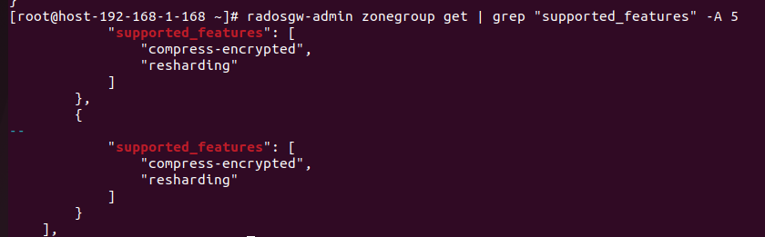

# Zone Features

1. Tổng quan

- Zone Features là các cờ flag được cấu hình trong file `zone.json`. Nó khai báo cho toàn bộ cụm Ceph biết rằng zone này đang được hỗ trợ các tính năng gì

- Sinh ra để giải quyết bài toán đồng bộ  đa vùng (Multi-site)

2. Các loại support features
  
- resharding (Reef): Cho phép bật tính năng Dynamic Bucket Resharding để chia nhỏ bucket thành các shard tránh việc bucket quá lớn gây tắc cổ chai

- compress-encrypted (Reef): Cho phép nén object ngay cả khi nó được mã hóa SSE

- Notification_v2 (Squid): Cho phép RGW bắn thông báo ra ngoài khi thay đổi trong Bucket

