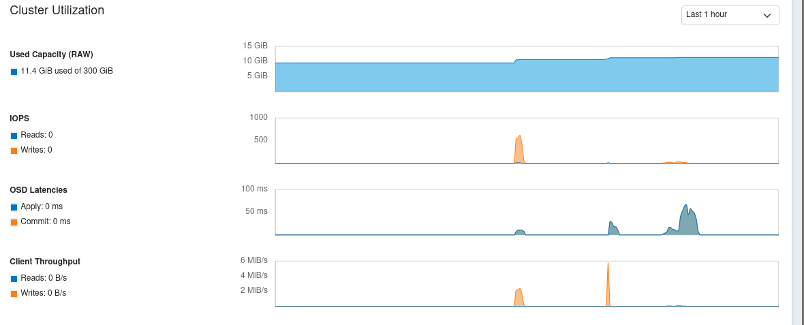

# Benchmark 
## Cephadm
Bước 1: Tạo pool trên Ceph để test
```sh 
cephadm shell -- ceph osd create pool  create test 128 128
cephadm shell -- ceph osd pool application enable test rdb
```
Bước 2: Tạo images
```sh
rbd create test/images --size 10G
```
Bước 3: Trên host cần có file `/etc/ceph/ceph.conf` và file keyring. Cần cài đặt `ceph-common` trên host để container trong cephadm có thể mount ra được vào kernal của máy host
```sh 
dnf install ceph-common -y
```
Bước 4: MAP Images (chạy trên host)
```sh
rbd device map test/images_test
lsblk
```
Bước 5: Gắn filesystem và mount
```sh
mkfs.ext4 /dev/rdb0
mkdir -p /mnt/test
mount /dev/rbd0 /mnt/test
```
Bước 5: Benchmark
1. Đo IOPS 
```sh
fio --name=test --bs=4k --iodepth=32 --direct=1 --rw=randwr --ioengine=libaio --size=1G --time_based --runtime=30s --filename=/dev/rbd0
```
2. Đo Thoughput
```sh
fio --name=test --bs=1M --iodepth=64 --direct=1 --rw=write --ioengine=libaio --size=2GB --time_based --runtime=30s --filename=/dev/rbd0
```
3. Đo latency
```sh
fio --name=test --bs=4k --iodepth=1 -direct=1 --rw=write --ioengine=libaio --size=2GB --filename=/dev/rbd0
```

KẾT QUẢ

