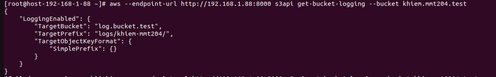
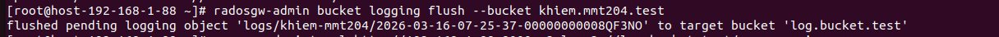
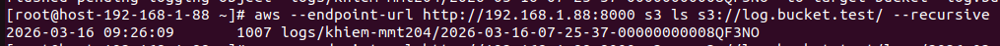
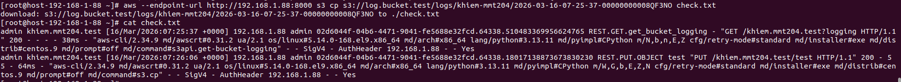

# Bucket Logging 

## Khái niệm

- Là cơ chế ghi lại toàn bộ lich sử truy cập và thao tác trên một bucket nguồn 

- Các bản ghi này được đóng gói và lưu trữ dưới dạng object bên trong 1 bucket riêng biệt gọi là Log Bucket

- Chỉ được áp dụng cho phiên bản v20.2.0 Tentacle
## Các quy tắc đối bắt buộc đối với Log Bucket

- Để làm nơi chứa log nó phải tuân thủ các điều kiện sau:

  - Phải được tạo trước khi bật tính năng ghi log cho bucket nguồn

  - Không được là chính bucket nguồn

  - Không được bật tính năng mã hóa, logging, nén hoặc RequestPayer trên Log Bucket này

  - Phải nằm cùng 1 Zonegroup với bucket nguồn

  - Có thể thuộc về nhiều tài khoản khác nhau nếu phân Bucket Policy hợp lý

## Độ tin cậy và cơ chế đồng bộ

- Đê đảm bảo hiệu suất, hệ thống không ghi trực tiếp log và Log Bucket

- Mặc định log chỉ được đẩy vào Log Bucket sau mỗi 5 phút hoặc file log đạt 128 MB dung lượng

- Trong khoảng thời gian chờ, file log sẽ được ghi ở vùng lưu trữ tạm, ta có thể dùng lệnh sau để ép nó ghi trực tiếp luôn vào Log Bucket

```sh
radosgw-admin bucket logging flush --bucket <ten_bucket>
```

## Các chế độ hoạt động

- Standard (Mặc định): Hệ thống sẽ ghi log sau khi thao tác người dùng đã hoàn tất. Nếu việc ghi log bị lỗi, các thao tác người dùng vẫn hoàn tất thành công bình thường. Định dạnh log sẽ theo chuẩn S3

- Journal: Hệ thống sẽ ghi log trước khi người dùng hoàn tất. Nếu việc ghi log thất bại, thao tác của người dùng sẽ bị lỗi ngay lập tức. Định dạng log sẽ đơn giản theo chuẩn riêng của Ceph

## Phân quyền và hạn mức

- Policy: Bucket Policy của Log Bucket phải cho phép hành động `s3:PutObject` được thực hiện bởi một chủ đề dịch vụ đặc biệt là `logging.s3.amazonaws.com`

- Quota: Hạn mức dung lượng (Quota) vẫn áp dụng bình thường trên Log Bucket. Nếu ở chế độ Journal Quota đầy, mọi thao tác trên bucket nguồn sẽ bị lỗi theo. Còn nếu ở chế độ Standard, các thao tác trên bucket nguồn vẫn hoạt động nhưng sẽ bỏ qua việc ghi log

## Triển khai 

1. Tạo 2 bucket mới 

```sh
# Tạo log bucket

aws s3 mb --endpoint http://10.2.6.128:8000 s3://log.bucket.test --region us-east-zg-1

# Tạo bucket nguồn

aws s3 mb --endpoint http://10.2.6.128:8000 s3://bucket.source.test --region us-east-zg-1

```

2. Tạo policy áp dụng cho log bucket

```sh
{
  "Version": "2012-10-17",
  "Statement": [
    {
      "Sid": "AllowLoggingFromSourceBucket",
      "Effect": "Allow",
      "Principal": {
        "Service": "logging.s3.amazonaws.com"
      },
      "Action": "s3:PutObject",
      "Resource": "arn:aws:s3:::log.bucket.test/*",
      "Condition": {
        "ArnLike": {
          "aws:SourceArn": "arn:aws:s3:::khiem.mmt204.test"
        }
      }
    }
  ]
}
```
3. Áp dụng policy cho log bucket

```sh

aws --endpoint-url http://10.2.6.128:8000 s3api put-bucket-policy --bucket log.bucket.test --policy file://log-policy.json 

```

4. Bật Logging trên Bucket nguồn 

- Tạo file cấu hình enable_logging.json

```sh

{
  "LoggingEnabled": {
    "TargetBucket": "log.bucket.test",
    "TargetPrefix": "logs/khiem-mmt204/"
  }
}
```

5. Áp dụng cho Bucket nguồn 

```sh

aws --endpoint-url http://192.168.1.88:8000 s3api put-bucket-logging     --bucket khiem.mmt204.test     --bucket-logging-status file://enable_logging.json 

```

6. Check xem bucket đã được được bật bucket logging chưa

```sh
aws --endpoint-url http://192.168.1.88:8000 s3api get-bucket-logging --bucket khiem.mmt204.test
```



7. Áp dụng xả log xuống ngay lập tức

- Do mặc định log chỉ được đẩy vào Log Bucket sau mỗi 5 phút hoặc file log đạt 128 MB dung lượng nên ta cần áp dụng lệnh xả log ngay lập tức vào bucket chứa log

```sh
radosgw-admin bucket logging flush --bucket khiem.mmt204.test
```



8. Check bucket ghi log đã có log chưa  

```sh
aws --endpoint-url http://192.168.1.88:8000 s3 ls s3://log.bucket.test/ --recursive
```




9. Tải xuống và xem log

```sh

aws --endpoint-url http://192.168.1.88:8000 s3 cp s3://log.bucket.test/logs/khiem-mmt204/2026-03-16-07-25-37-00000000008QF3NO check.txt
```



10. Thêm đoạn code python để dễ xem log

```sh
import re

LOG_PATTERN = re.compile(
    r'(?P<owner>\S+) '
    r'(?P<bucket>\S+) '
    r'\[(?P<time>.*?)\] '
    r'(?P<ip>\S+) '
    r'(?P<requester>\S+) '
    r'(?P<req_id>\S+) '
    r'(?P<operation>\S+) '
    r'(?P<key>\S+) '
    r'"(?P<request_uri>.*?)" '
    r'(?P<status>\S+) '
    r'(?P<error_code>\S+) '
    r'(?P<bytes_sent>\S+) '
    r'(?P<obj_size>\S+) '
    r'(?P<total_time>\S+) '
    r'(?P<turnaround_time>\S+) '
    r'(?P<referer>\S+|".*?") '
    r'"(?P<user_agent>.*?)"'
)

# ── Bảng dịch hành động ──────────────────────────────────────────────────────
ACTION_MAP = {
    "PUT":       "📤 Tải lên",
    "GET":       "📥 Tải xuống",
    "DELETE":    "🗑️  Xóa file",
    "HEAD":      "🔍 Kiểm tra",
    "LIST":      "📂 Liệt kê",
    "COPY":      "📋 Sao chép",
    "OPTIONS":   "🔒 Kiểm tra quyền",
    "POST":      "✨ Tạo mới",
    "COMPLETE":  "✅ Hoàn thành upload",
    "ABORT":     "❌ Hủy upload",
    "INIT":      "▶️  Bắt đầu upload",
}

# ── Bảng dịch mã HTTP ─────────────────────────────────────────────────────────
STATUS_MAP = {
    "200": "✅ Thành công",
    "204": "✅ Thành công (không có nội dung)",
    "206": "✅ Tải một phần",
    "304": "ℹ️  Không thay đổi",
    "400": "⚠️  Yêu cầu không hợp lệ",
    "403": "🚫 Bị từ chối truy cập",
    "404": "❓ Không tìm thấy file",
    "405": "⚠️  Phương thức không được phép",
    "409": "⚠️  Xung đột dữ liệu",
    "500": "💥 Lỗi máy chủ",
    "503": "💥 Dịch vụ không khả dụng",
}


def translate_action(operation):
    """Lấy phần động từ chính từ chuỗi như REST.PUT.OBJECT → Tải lên"""
    parts = operation.split(".")
    for part in reversed(parts):
        if part in ACTION_MAP:
            return ACTION_MAP[part]
    return f"⚙️  {operation}"


def translate_status(status):
    return STATUS_MAP.get(status, f"HTTP {status}")


def format_size(value):
    """Đổi bytes sang KB/MB cho dễ đọc"""
    if value in ("-", "0"):
        return None
    try:
        n = int(value)
        if n == 0:
            return None
        if n < 1024:
            return f"{n} B"
        if n < 1024 ** 2:
            return f"{n / 1024:.1f} KB"
        return f"{n / 1024 ** 2:.1f} MB"
    except ValueError:
        return None


def format_time_ms(value):
    """Đổi milliseconds sang dạng dễ đọc"""
    if value in ("-",):
        return None
    try:
        n = int(value)
        return f"{n} ms" if n < 1000 else f"{n / 1000:.1f} giây"
    except ValueError:
        return None


def short_user(requester):
    """Rút gọn ARN dài thành tên người dùng ngắn"""
    if requester == "-":
        return "Khách (ẩn danh)"
    # arn:aws:iam::123456789:user/alice  →  alice
    if "user/" in requester:
        return requester.split("user/")[-1]
    if "assumed-role/" in requester:
        return requester.split("assumed-role/")[-1].split("/")[0]
    return requester[:30]


def parse_and_print(input_file):
    print()
    print("=" * 60)
    print("  NHẬT KÝ HOẠT ĐỘNG LƯU TRỮ")
    print("=" * 60)

    success = error = skipped = 0

    with open(input_file, "r", encoding="utf-8") as f:
        for line in f:
            line = line.strip()
            if not line:
                continue

            match = LOG_PATTERN.search(line)
            if not match:
                skipped += 1
                continue

            d = match.groupdict()

            action   = translate_action(d["operation"])
            status   = translate_status(d["status"])
            user     = short_user(d["requester"])
            filename = d["key"] if d["key"] != "-" else "(không có tên)"
            size     = format_size(d["bytes_sent"])
            duration = format_time_ms(d["turnaround_time"])

            # Xác định thành công / lỗi để đếm thống kê
            code = int(d["status"]) if d["status"].isdigit() else 0
            if 200 <= code < 300:
                success += 1
            elif code >= 400:
                error += 1

            # ── In ra ────────────────────────────────────────────────────────
            print()
            print(f"  🕐 {d['time']}")
            print(f"  {action}  →  {filename}")
            print(f"     Người dùng : {user}")
            print(f"     Địa chỉ IP : {d['ip']}")
            print(f"     Kết quả    : {status}", end="")
            if d["error_code"] != "-":
                print(f"  (lỗi: {d['error_code']})", end="")
            print()
            if size:
                print(f"     Dung lượng : {size}")
            if duration:
                print(f"     Thời gian  : {duration}")
            print("  " + "─" * 48)

    # ── Tóm tắt cuối ─────────────────────────────────────────────────────────
    total = success + error
    print()
    print("=" * 60)
    print("  TÓM TẮT")
    print(f"  Tổng sự kiện   : {total + skipped}")
    print(f"  Đọc được       : {total}")
    print(f"  ✅ Thành công  : {success}")
    print(f"  ❌ Có lỗi      : {error}")
    if skipped:
        print(f"  ⚠️  Bỏ qua      : {skipped} dòng không đúng định dạng")
    print("=" * 60)
    print()


if __name__ == "__main__":
    parse_and_print("check.txt")
```

11. Ta có thể triển khai cho bucket này bucket lifecycle để tự động xóa các file log 