# Triển khai bucket-notification với endpoint là Kafka
## Chuẩn bị 

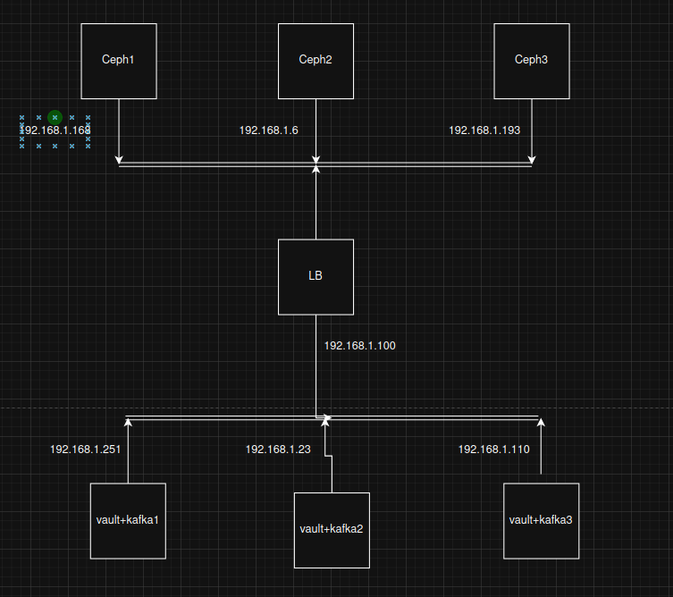

## Cài đặt và cấu hình
### Cấu hình cụm kafka
1. Cài đặt môi trường Java để Kafka vận hành
```sh 
sudo apt update
sudo apt install -y openjdk-17-jdk
```
2. Tải và giải nén Kafka
```sh
wget https://dlcdn.apache.org/kafka/4.2.0/kafka_2.13-4.2.0.tgz
tar -xzf kafka_2.13-4.2.0.tgz
sudo mv kafka_2.13-4.2.0 /opt/kafka
```
3. Cấu hình 
- Cấu hình tại `/opt/kafka/config/server.properties`. Tìm và chỉnh sửa cấu hình các dòng sau ở cả 3 nodes
```sh
process.roles=broker,controller
node.id=1 #Chỉnh theo từng node
controller.quorum.voters=1@10.2.4.212:9093,2@10.2.4.217:9093,3@10.2.4.216:9093 #Nhớ là đúng thứ tự
listeners=PLAINTEXT://10.2.4.212:9092,CONTROLLER://10.2.4.212:9093 #Lắng nghe địa chỉ ip của máy host
inter.broker.listener.name=PLAINTEXT
advertised.listeners=PLAINTEXT://10.2.4.212:9092,CONTROLLER://10.2.4.212:9093
controller.listener.names=CONTROLLER
log.dirs=/var/lib/kafka
```
- Trên 1 node random mã uuid, lưu lại để format cho chung 3 nodes
```sh 
/opt/kafka/bin/kafka-storage.sh random-uuid
```

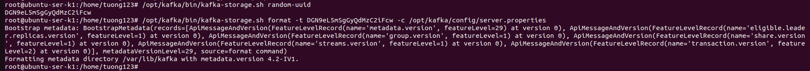

- Format trên cả 3 nodes chung uuid
```sh
/opt/kafka/bin/kafka-storage.sh format -t <Tên-uuid> -c /opt/kafka/config/server.properties
```
- Khởi động server Kafka
```sh
/opt/kafka/bin/kafka-server-start.sh -daemon /opt/kafka/config/server.properties
```
- Tạo topic cho kafka
```sh
/opt/kafka/bin/kafka-topics.sh --create --topic ceph-kafka-topic --bootstrap-server localhost:9092 --partitions 3 --replication-factor 3
```
- Xem tất cả các topic của kafka đã tạo
```sh
/opt/kafka/bin/kafka-topics.sh --list --bootstrap-server localhost:9092
```
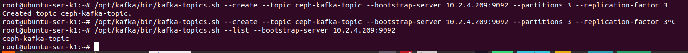

- Check cụm đã hoạt động đúng chưa
```sh
/opt/kafka/bin/kafka-metadata-quorum.sh --bootstrap-server 10.2.4.209:9092 describe --status
```
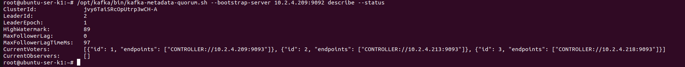

- Tạo topic cho bucket
```sh
aws --endpoint-url http://10.2.4.209:8000 sns create-topic --name ceph-kafka-topic --attributes='{"push-endpoint": "kafka://10.2.4.209:9092"}'
```
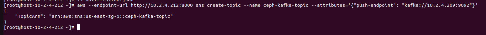


- Tạo file `notification.json` để chọn loại event thông báo:
```sh
{
    "TopicConfigurations": [
        {
            "Id": "KafkaNotify",
            "TopicArn": "arn:aws:sns:us-east-zg-1::ceph-kafka-topic",
            "Events": [
                "s3:ObjectCreated:*",
                "s3:ObjectRemoved:*"
            ]
        }
    ]
}
```
- Áp dụng chính sách cho bucket
```sh
aws --endpoint-url http://10.2.4.209:8000 s3api put-bucket-notification-configuration --bucket khiem.mmt.test     --notification-configuration file://notification.json 
```
## Cấu hình để đẩy thông tin lên Telegram

- Cấu hình Tele để nhận thông báo từ kafka
Bước 1: Tạo Telegram Bot
 - Vào Telegram, tìm kiếm @BotFather
 - Nhấn Start, sau đó gõ /newbot
 - Đặt tên cho bot của bạn
 - Đặt username cho bot (phải kết thúc bằng "bot")
 - Lưu lại Token API được cấp

Bước 2: Cài đặt Python và các thư viện cần thiết
```sh
sudo apt install -y python3 python3-pip
pip3 install kafka-python python-telegram-bot
```

Bước 3: Tạo script Python để kết nối Kafka và gửi tin nhắn đến Telegram
```sh
import json
import requests
from confluent_kafka import Consumer
from datetime import datetime, timedelta

TELE_TOKEN = ''
CHAT_ID = ''

def format_size(size_bytes):
    if size_bytes == 0:
        return "0B"
    for unit in ['B', 'KB', 'MB', 'GB']:
        if size_bytes < 1024:
            return f"{size_bytes:.2f} {unit}"
        size_bytes /= 1024

def get_encryption_info(record):
    """
    Ceph RGW KHÔNG ghi SSE headers vào responseElements/requestParameters.
    Thông tin mã hóa nằm trong s3.object.metadata dưới dạng:
      {"key": "x-amz-meta-x-encrypt-mode", "val": "sse-c"}   ← dùng "val" không phải "value"
    """
    obj      = record.get('s3', {}).get('object', {})
    metadata = obj.get('metadata', [])

    # Map giá trị Ceph → tên hiển thị
    ENCRYPT_MODE_MAP = {
        'sse-c':   '🔐 SSE-C (AES256)',
        'sse-kms': '🔐 SSE-KMS',
        'sse-s3':  '🔐 SSE-S3 (AES256)',
        'aes256':  '🔐 SSE-S3 (AES256)',
    }

    if isinstance(metadata, list):
        meta_dict = {}
        for item in metadata:
            k = item.get('key', '').lower()
            # Ceph dùng "val", không phải "value"
            v = item.get('val') or item.get('value') or ''
            meta_dict[k] = str(v).lower().strip()

        # ── 1. Trường chuyên dụng của Ceph: x-amz-meta-x-encrypt-mode ──────
        encrypt_mode = meta_dict.get('x-amz-meta-x-encrypt-mode', '')
        if encrypt_mode:
            return ENCRYPT_MODE_MAP.get(encrypt_mode, f"🔐 SSE ({encrypt_mode.upper()})")

        # ── 2. Fallback: tìm theo pattern key chứa 'encrypt' hoặc 'sse' ────
        for k, v in meta_dict.items():
            if 'encrypt-mode' in k or 'encryption-mode' in k:
                return ENCRYPT_MODE_MAP.get(v, f"🔐 SSE ({v.upper()})")
            if 'customer-algorithm' in k:
                return f"🔐 SSE-C ({v.upper()})"
            if 'server-side-encryption' in k and 'customer' not in k:
                up = v.upper()
                if 'KMS' in up:
                    return "🔐 SSE-KMS"
                if 'AES' in up:
                    return "🔐 SSE-S3 (AES256)"

    return "🔓 Không mã hóa (Plaintext)"


def send_tele(text):
    url = f"https://api.telegram.org/bot{TELE_TOKEN}/sendMessage"
    data = {"chat_id": CHAT_ID, "text": text, "parse_mode": "Markdown"}
    try:
        r = requests.post(url, data=data, timeout=10)
        if not r.ok:
            print(f"Telegram lỗi {r.status_code}: {r.text[:200]}")
    except Exception as e:
        print(f"Lỗi gửi Telegram: {e}")


c = Consumer({
    'bootstrap.servers': '10.2.4.212:9092',
    'group.id': 'tele-group-v6',
    'auto.offset.reset': 'latest',
})
c.subscribe(['ceph-kafka-topic'])

print("🚀 Script đang chạy... Đang đợi sự kiện từ Ceph RGW...")

try:
    while True:
        msg = c.poll(1.0)
        if msg is None:
            continue
        if msg.error():
            print(f"Lỗi Kafka: {msg.error()}")
            continue

        try:
            raw_data = msg.value().decode('utf-8')
            data = json.loads(raw_data)

            for record in data.get('Records', []):
                utc_time_str = record.get('eventTime', '').split('.')[0]
                utc_dt = datetime.strptime(utc_time_str, "%Y-%m-%dT%H:%M:%S")
                vn_dt = utc_dt + timedelta(hours=7)
                time_display = vn_dt.strftime("%H:%M:%S - %d/%m/%Y")

                event_name  = record.get('eventName', 'N/A')
                bucket_name = record.get('s3', {}).get('bucket', {}).get('name', 'N/A')
                object_key  = record.get('s3', {}).get('object', {}).get('key', 'N/A')
                object_size = record.get('s3', {}).get('object', {}).get('size', 0)
                user        = record.get('userIdentity', {}).get('principalId', 'N/A')
                encryption  = get_encryption_info(record)

                text_message = (
                    f"🔔 *THÔNG BÁO CEPH S3*\n"
                    f"━━━━━━━━━━━━━━━━━━\n"
                    f"📝 *Hành động:* `{event_name}`\n"
                    f"📁 *Bucket:* `{bucket_name}`\n"
                    f"📄 *File:* `{object_key}`\n"
                    f"⚖️ *Size:* `{format_size(object_size)}`\n"
                    f"🛡️ *Mã hóa:* `{encryption}`\n"
                    f"👤 *User:* `{user}`\n"
                    f"⏰ *Giờ VN:* `{time_display}`\n"
                    f"━━━━━━━━━━━━━━━━━━"
                )
                send_tele(text_message)
                print(f"✅ {object_key} | {encryption}")

        except Exception as e:
            print(f"Lỗi xử lý JSON: {e}")

except KeyboardInterrupt:
    print("Dừng script...")
finally:
    c.close()
```
Bước 4: Tạo systemd cho script đó
```sh
cat > /etc/systemd/system/ceph-kafka-tele.service << 'EOF'
[Unit]
Description=Ceph Kafka Telegram Notifier
After=network.target

[Service]
Type=simple
User=root
WorkingDirectory=/root
ExecStart=/usr/bin/python3 /root/TEST3.py
Restart=always
RestartSec=5
StandardOutput=journal
StandardError=journal

[Install]
WantedBy=multi-user.target
EOF
```
Bước 5: Reload 
```sh
systemctl daemon-reload
systemctl enable ceph-kafka-tele
systemctl start ceph-kafka-tele
```
## Thử nghiệm
1. Upload file thường 
```sh
aws --endpoint http://10.2.6.128:8000 s3 cp test1.txt s3://khiem.mmt204.test/test 
```
- Xem thông tin được gửi tới kafka dưới dạng JSON
```sh
/opt/kafka/bin/kafka-console-consumer.sh     --bootstrap-server 192.168.1.100:9092     --topic ceph-kafka-topic     --from-beginning
```
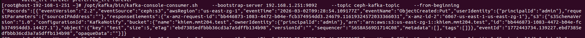

- Thông tin gửi lên tele

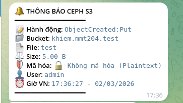

2. Upload file SSE-S3
- Khi upload file mã hóa, thông tin gửi về Kafka sẽ không cho tiêu đề mã hóa. Cần thêm trường `--metadata` để định dạng loại mã hóa upload

```sh
 aws --endpoint http://10.2.6.128:8000 s3 cp test1.txt s3://khiem.mmt204.test/test --sse  AES256 --metadata "x-encrypt-mode=sse-s3"
```
- Thông tin sẽ được gửi dưới dạng JSON qua Kafka cùng metadata là sse-s3

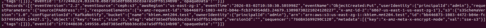

- Thông tin được gửi lên telegram

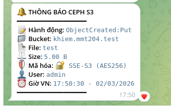

3. Upload file SSE-KMS
- Tương tự như SSE-S3 ta cũng cần thêm trường metadata để Kafka nhận diện
```sh
aws --endpoint http://10.2.6.128:8000 s3 cp test1.txt s3://khiem.mmt204.test/test --sse aws:kms --sse-kms-key-id ceph-bucket-key --metadata "x-encrypt-mode=sse-kms"
```
- Thông tin sẽ được gửi sang Kafka

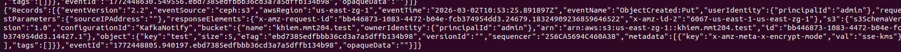

- Thông tin gửi lên telegram

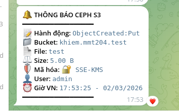

4. Upload file SSE-C
- Tương tự như trên vẫn cần thêm metadata vào để nhận diện
```sh
aws --endpoint-url http://10.2.6.128:8000 s3api put-object --bucket khiem.mmt204.test --key test-debug --body test1.txt --sse-customer-algorithm AES256 --sse-customer-key fileb://sse.key --metadata "x-encrypt-mode=sse-c" 
```
- THông tin gửi sang Kafka

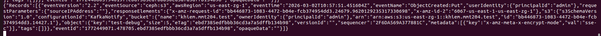

- Thông tin gửi lên Telegram

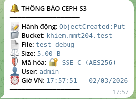

