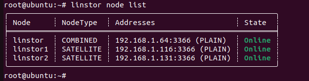
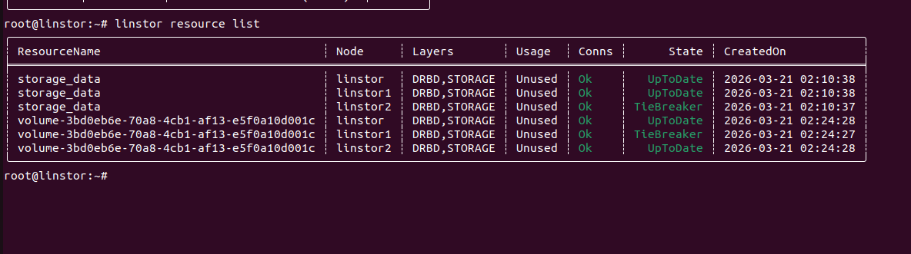

# Triển khai Linstor làm backend cho Openstack

## Chuẩn bị 

- Chuẩn bị 4 node Ubuntu 22.04/24.04:

  - Controller Node (linstor): IP 192.168.1.64 (Chạy LINSTOR Controller + Satellite)

  - Compute Node 1 (linstor1): IP 192.168.1.116

  - Compute Node 2 (linstor2): IP 192.168.1.131
  
  - 1 Node Openstack: 192.168.1.84
## Triển Khai

### Triển khai cluster linstor

- Khai báo tên node vào trong `/etc/hosts` trên cả 3 node 

```sh
192.168.1.64 linstor

192.168.1.116 linstor1

192.168.1.131 linstor2

```

- Cài đặt các phần mềm cần thiết trên cả 3 node linstor

```sh
# Thêm repository
sudo add-apt-repository ppa:linbit/linbit-drbd9-stack
sudo apt update

# Cài đặt DRBD kernel module và các công cụ hỗ trợ
sudo apt install drbd-dkms drbd-utils -y

```

- Trên node Controller 

```sh
sudo apt install linstor-controller linstor-client -y
sudo systemctl enable --now linstor-controller
sudo apt install linstor-satellite -y
sudo systemctl enable --now linstor-satellite
sudo apt install socat lsscsi bcache-tools -y
```

- Trên node Statellite

```sh
sudo apt install linstor-satellite -y
sudo systemctl enable --now linstor-satellite
```

- Cấu hình cụm (thực hiện trên controller)

```sh
# Khai báo node 1 (vừa là Controller vừa là Satellite)
linstor node create linstor 192.168.1.64 --node-type Combined

# Khai báo các node còn lại
linstor node create linstor1 192.168.1.116
linstor node create linstor2 192.168.1.131
```
- Check xem cụm hoạt động không

```sh
linstor node list
```



- Tạo Storage Pool (LVM-Thin)

  - Tạo Volume Group vật lý 
```sh
pvcreate /dev/vdb
vgcreate linstor_vg /dev/vdb
lvcreate -L 15G -T linstor_vg/thin_pool
```
  - Khai báo Pool vào Linstor (trên Controller):
```sh
linstor storage-pool create lvmthin linstor storage_data linstor_vg/thin_pool
linstor storage-pool create lvmthin linstor1 storage_data linstor_vg/thin_pool
linstor storage-pool create lvmthin linstor2 storage_data linstor_vg/thin_pool
```

  - Tải driver của linstor cho Cinder 
```sh
cd /tmp
git clone https://github.com/LINBIT/openstack-cinder.git
```
  - Copy file `linstordrv.py` từ clone vừa tải về driver của cinder
```sh
cd /usr/lib/python3/dist-packages/cinder/volume/drivers
cp -r openstack-cinder/cinder/volume/drivers/linstordrv.py /usr/lib/python3/dist-packages/cinder/volume/drivers/
```
  - Vào openstack cấu hình cinder
```sh
[linstor-drbd]
volume_driver = cinder.volume.drivers.linstordrv.LinstorDrbdDriver
volume_backend_name = LINSTOR_DRBD
linstor_uris = linstor://192.168.1.64:3366
# # Tên Storage Pool bạn đã tạo ở bước trước (ví dụ: storage_data)
linstor_default_storage_pool_name = storage_data
# Số lượng bản sao mặc định cho mỗi Volume (Replication factor)
linstor_default_redundancy = 3
# (Tùy chọn) Nếu bạn dùng LVM-Thin
linstor_volume_type = lvmthin

[Default]
enabled_backends = linstor-drbd
```
  - Cài đặt linstor, DRBD trên node openstack sử dụng tính năng Diskless để join node openstack vào cụm linstor
```sh

sudo apt install drbd-utils -y
sudo apt install linstor-satellite -y
sudo systemctl enable --now linstor-satellite
linstor node create linstor1 192.168.1.84
```
  - Restart lại dịch vụ cinder
  - Tạo volume và xemm trạng thái linstor
```sh
linstor resource list
```


Giải thích

- Layers(DRBD,STORAGE): Sử dụng 2 công nghệ là DRBD để replicated dữ liệu và Storage để cấp phát dung lượng vật lý

- Usage: Unused nghĩa là volume đấy chưa được gắn attach vào bất kì instance nào

- Conns: Trạng thái kết nối giữa 3 linstor ổn định là OK

- State:

  - Uptodate(Bản sao chính): chỉ các node thực tế lưu dữ liệu

  - TieBreaker(Trọng tài): Chỉ chạy lớp mạng, không tiêu tốn Storage

Tại sao cần thằng TieBreaker: Để hệ thống hoạt động an toàn, cần cơ chế biểu quyết số lẻ Quorum để chống lỗi Split-Brain

