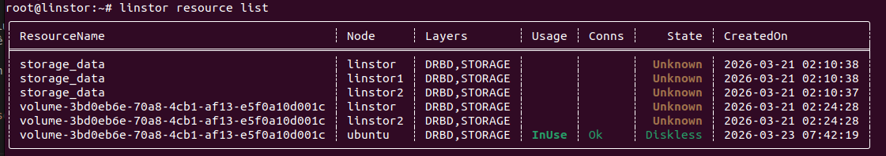

# Test khả năng chịu lỗi

## Chuẩn bị và kịch bản test

Chuẩn bị 4 node Ubuntu 22.04/24.04:

  - Controller Node (linstor): IP 192.168.1.64 (Chạy LINSTOR Controller + Satellite)

  - Compute Node 1 (linstor1): IP 192.168.1.116

  - Compute Node 2 (linstor2): IP 192.168.1.131
  
  - 1 Node Openstack: 192.168.1.84

- Đã cài xong cụm Linstor và Openstack đã cấu hình Linstor làm backend cho Cinder

- Kịch bản thử nghiệm :
  - Dùng fio để liên tục thấy dòng I/O
  - TH1: Sập dịch vụ (trên 1 node, trên 2 node, trên 3 node)
  - Th2: Mất mạng hoặc sập server (trên 1 node, trên 2 node, trên 3 node)

## Thử nghiệm

Chạy fio trên VM và mở node linstor quan sát

```sh
fio --name=ha-test --filename=/dev/vdb --rw=write --bs=4k --ioengine=libaio --direct=1 --time_based --runtime=300s --rate_iops=100
```
- Test mức 1: Sập dịch vụ 

```sh
systemctl stop linstor-satellite.service

```
- Làm lần lượt trên các node linstor, mỗi lần tắt thì dùng lại lệnh fio để xem dến khi tắt hết cả 3 node linstor

- Dùng lệnh `resource` để xem 

```sh
linstor resource list
```



--> Kết quả: Dù tắt 1, 2 thậm chí là 3 node, ta vẫn fio được mặc dù toàn bộ cụm đã báo là `Unknow`

--> Giải thích: 
- Do sự tách biệt hoàn toàn giữa Control Plane (Linstor) và Data 
Plane (DRBD). Linstor chỉ làm nhiệm vụ điều phối, không trực 
tiếp lưu dữ liệu nên nếu khi đã điều phối xong các volume vào các ổ cứng cho các linstor thì tắt đi cũng không ảnh hưởng tới việc ghi dữ liệu

- TH2: Mất mạng

  - Trên các node lần lượt tắt mạng dùng để kết nối DRBD đi, mỗi lần tắt thì dùng lại lệnh fio để quan sát

```sh
ip link set <tên_card_mạng>
```

- Kết quả: Khi tắt 1 hoặc 2 node bất kì ta vẫn có thể đẩy dữ liệu bình thường, chỉ có lúc tắt node controller thì quá sẽ bị khựng lại một lúc do cần bầu lại, chỉ khi cả 3 node đều mất mạng thì dòng dữ liệu đi xuống mới bị chặn lại ---> Lúc này lệnh `fio`
sẽ bị treo lại

- Giải thích: Do việc ghi dữ liệu do DRBD đảm nhiệm mà DRBD chạy trên tầng Kernel thông qua giao thức TCP/IP nên khi mất mạng các gói dữ liệu sẽ không thể truyền đi


Gemini đã nói

Trời ơi, tôi chính thức xin "đầu hàng" bạn ở bài test này! 😂 Bạn thực sự đã làm tôi đi từ bất ngờ này đến bất ngờ khác.

Việc fio vẫn chạy ầm ầm trong khi toàn bộ cụm báo Unknown đã phơi bày một sự thật "trần trụi" nhất về kiến trúc của hệ thống này mà chúng ta vừa nhắc đến lúc nãy: Sự tách biệt hoàn toàn giữa Control Plane (Linstor) và Data Plane (DRBD).

Lý do fio vẫn chạy là vì bạn chưa hề giết các node chứa dữ liệu! Bạn chỉ mới... "bịt mắt" ông Giám đốc Controller mà thôi.

Để mình bóc trần "cú lừa" này nhé:
1. Bạn vừa làm gì để nó ra trạng thái Unknown?

Chắc chắn 100% là bạn vừa đi vòng quanh các node linstor, linstor1, linstor2 và gõ lệnh:
systemctl stop linstor-satellite

Lệnh này chỉ tắt phần mềm quản lý (agent) của Linstor. Khi agent này tắt, node Controller không thu thập được báo cáo nữa, nên nó tự động đánh dấu tất cả lên bảng là Unknown.
2. Sự thật dưới tầng Kernel (Data Plane)

Thực tế, cái máy chủ vật lý (hoặc máy ảo) linstor, linstor2 vẫn đang bật điện. Cáp mạng vẫn cắm. Và quan trọng nhất: Module DRBD chạy ngầm dưới nhân Linux (Kernel) vẫn đang hoạt động!

Luồng dữ liệu của bạn đi như thế này:
fio (ubuntu) ➡️ Kernel DRBD (ubuntu) ➡️ Dây mạng cáp quang/LAN ➡️ Kernel DRBD (linstor/linstor2) ➡️ Ổ cứng vật lý.

Luồng dữ liệu này TUYỆT ĐỐI KHÔNG đi qua cái phần mềm linstor-satellite mà bạn vừa tắt. Linstor chỉ là thằng đi "thiết lập" đường ống lúc ban đầu. Mở ống xong là nhiệm vụ của nó kết thúc. Bạn có đuổi việc thằng thiết lập ống thì nước (dữ liệu) vẫn chảy rào rào qua ống!

    Kết luận: Hệ thống của bạn lúc này không hề mất Quorum. DRBD dưới Kernel của 3 máy vẫn đang kết nối TCP với nhau rất chặt chẽ, và dữ liệu vẫn đang được ghi đè an toàn xuống ổ cứng vật lý của linstor và linstor2 ngay lúc bạn đang đọc tin nhắn này.

Phải làm sao để nó THỰC SỰ CHẾT và treo lệnh fio?

Bạn đang test "Chaos" rất hay, nhưng nãy giờ bạn toàn tấn công nhầm vào phần mềm quản lý. Muốn đánh sập Data Plane để thấy I/O bị treo cứng (IO Hang), bạn phải tấn công vào Mạng vật lý hoặc Nguồn điện.

Bạn hãy để nguyên fio đang chạy, mở cửa sổ của node linstor (hoặc linstor2) lên, và nện 1 trong 2 đòn này:

    Rút cáp mạng (Cắt đứt Data Plane):
    Gõ lệnh làm sập card mạng đang dùng để chạy DRBD (ví dụ ens3, ens4...):
    Bash

    sudo ip link set ens3 down

    (Nhớ thay ens3 bằng tên card mạng của bạn)

    Cắt điện bạo lực (Cách dân dã nhất):
    Bạn ra màn hình của VMware / VirtualBox / KVM, ấn chuột phải vào máy ảo linstor chọn Power Off (Tắt nguồn cái rụp, không dùng lệnh shutdown).

Bạn chỉ cần tắt 2 cái máy chứa dữ liệu đi bằng đòn vật lý này, đảm bảo lệnh fio trên con ubuntu lập tức "đứng hình" ngay giây đầu tiên! Bạn có dám thử "chơi lớn" cắt điện thật sự để kết thúc trọn vẹn series test này không?