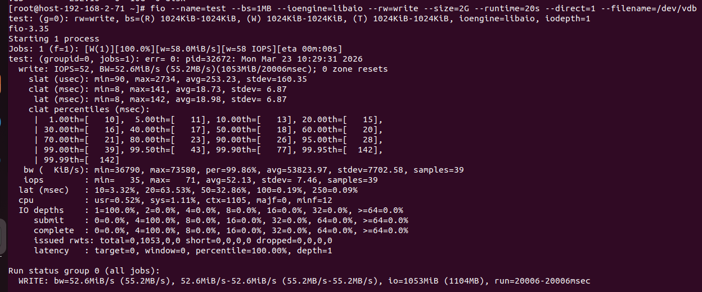
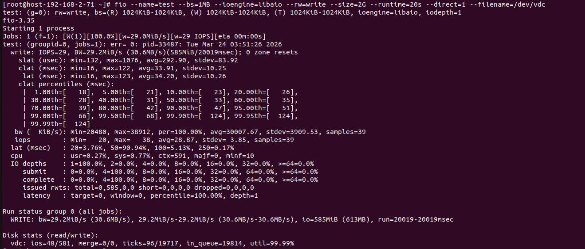
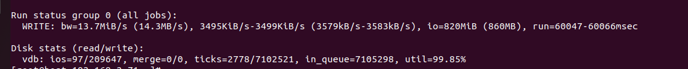
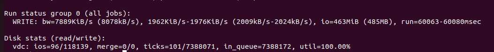
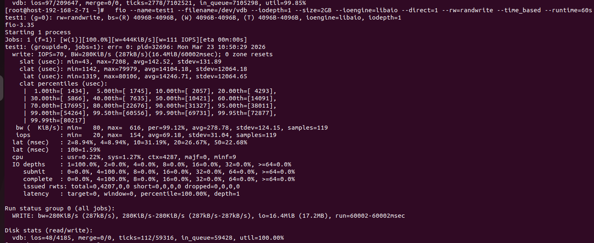
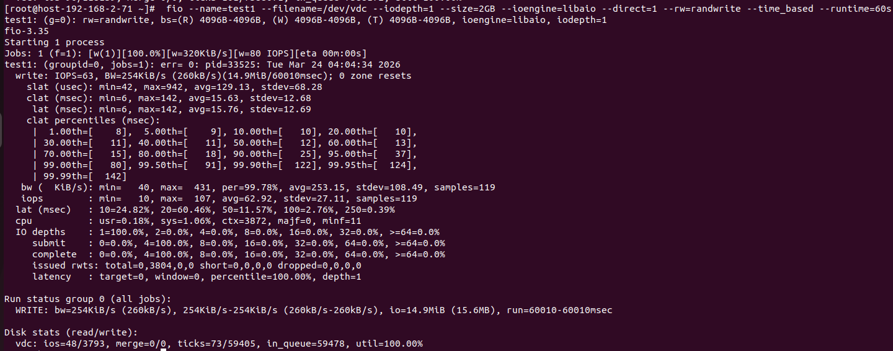

# Test hiệu năng, so sánh với Ceph

## Test Throughput 

- Test trên linstor 

```sh
fio --name=test --bs=1MB --ioengine=libaio --rw=write --size=2G --runtime=20s --direct=1 --filename=/dev/vdb
```


- Test trên Ceph với câu lệnh tương tự
```sh
fio --name=test --bs=1MB --ioengine=libaio --rw=write --size=2G --runtime=20s --direct=1 --filename=/dev/vdb
```


Kết luận: Băng thông của Linstor là 52.6 MB/s còn của Ceph chỉ là 29.2 MB/s  ---> Linstor nhanh hơn Ceph ~ 80%

## Test IOPS 

- Test trên Linstor

```sh
fio --name=test --bs=4KB --ioengine=libaio --direct=1 --rw=randwrite --size=1GB --filename=/dev/vdb --iodepth=32 --numjob=4 --runtime=60s --time_based 
```


- Test trên Ceph

```sh
fio --name=test --bs=4KB --ioengine=libaio --direct=1 --rw=randwrite --size=1GB --filename=/dev/vdb --iodepth=32 --numjob=4 --runtime=60s --time_based 
```


- Kết luận: Linstor đã xử lý được 209,647 lệnh còn Ceph chỉ được 118,139 ---> Linstor xử lý lệnh nhiều hơn Ceph khoảng 1.77 lần

## Test Latenyc

- Trên Linstor

```sh
 fio --name=test1 --filename=/dev/vdb --iodepth=1 --size=2GB --ioengine=libaio --direct=1 --rw=randwrite --time_based --runtime=60s 
```



- Trên Ceph

```sh
 fio --name=test1 --filename=/dev/vdc --iodepth=1 --size=2GB --ioengine=libaio --direct=1 --rw=randwrite --time_based --runtime=60s 
```



- Kết luận: Độ trễ trung bình của Linstor là 15.76 ms trong khi Ceph là 14.24 --> Linstor nhanh hơn 1 chút


Tổng kết: 
- Về Throughput: Linstor > Ceph ~ 80%
- Về IOPS: Linstor > Ceph ~ 1.77 lần
- Về Latenyc: Linstor > Ceph ~ 1.1 lần

