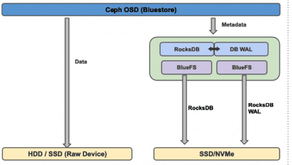

# WAL DEVICE
## Tổng quát 
1. Khái niệm 
- Wal device (Write Ahead logging device) là một thiết bị lưu trữ chuyên dụng hoặc phần cứng được tối ưu hóa để ghi nhật ký trước khi thực hiện các hoạt động ghi dữ liệu chính trên hệ thống lưu trữ.
2 Tại sao cần wal device?
- Giả sử ta có 1 ổ cứng HDD chứa được nhiều dung lượng nhưng việc ghi dữ liệu là random write --> rất chậm. Trong khi đó WAL device là ghi tuần tự (sequential write) --> rất nhanh. Vậy nếu chúng ở cùng trên một ổ cứng HDD thì sao? --> Đầu đọc vừa phải chạy để ghi tuần tự vào wal device vừa phải chạy để ghi vào random write --> rất chậm. Nó sẽ bị quá tải làm nghẽn toàn bộ hệ thống lưu trữ.
- Vì vậy ta cần tách riêng wal device ra một thiết bị lưu trữ khác (thường là SSD) để chuyên ghi nhật ký trước khi ghi dữ liệu chính vào ổ cứng HDD. Việc này giúp cải thiện hiệu suất ghi dữ liệu tổng thể của hệ thống lưu trữ trữ.
3. Ưu điểm của wal device
- Cải thiện hiệu suất ghi dữ liệu: Wal device giúp tăng tốc độ ghi dữ liệu tổng thể của hệ thống lưu trữ bằng cách giảm thiểu thời gian chờ đợi và tối ưu hóa quá trình ghi dữ liệu.
- Giảm độ trễ: Việc sử dụng wal device giúp giảm độ trễ trong quá trình ghi dữ liệu, đặc biệt là trong các hệ thống có tải cao hoặc yêu cầu hiệu suất cao.
- Tăng độ tin cậy: Wal device giúp đảm bảo tính toàn vẹn của dữ liệu bằng cách ghi nhật ký các thay đổi trước khi thực hiện các hoạt động ghi dữ liệu chính.
## WAL device trong Ceph

1. Khái niệm
- Trong Ceph, Wal device trong BlueStore là một phân vùng đặc biệt để ghi tạm thời dữ liệu trước khi ghi vào ổ cứng chính.
2. Cách hoạt động
 - Khi có dữ liệu mới cần ghi, BlueStore sẽ ghi dữ liệu này sẽ được ghi nhanh vào Wal device
 - Hệ thống xác nhận với client rằng dữ liệu đã được ghi thành công trên Wal device
 - Sau đó, BlueStore sẽ tiến hành ghi dữ liệu từ Wal device vào ổ cứng
 - Khi ghi xong dữ liệu trên WAL device sẽ được xóa bỏ để giải phóng không gian lưu trữ
3. Ưu điểm
- Sử dụng SSD hoặc NVMe là WAL device giúp cải thiện hiệu suất ghi dữ liệu tổng thể của hệ thống lưu trữ Ceph
- Đảm bảo dữ liệu vẫn còn khi hệ thống gặp sự cố đột ngột
- WAL dùng kiểu ghi tuần tự (sequential write) giúp tăng tốc độ ghi dữ liệu
